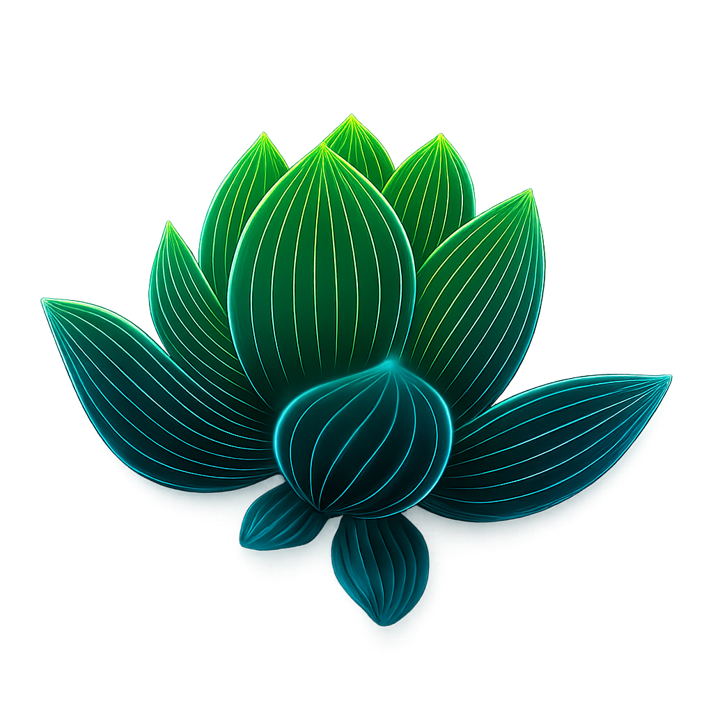

# 🌟 Notre Équipe 🌟

Découvrez l'équipe passionnée qui anime Midnight City RP et veille à votre expérience de jeu.

!!! info "Information importante"
    **Ces pages peuvent être éditées à tout moment donc en cas de doute n'hésitez pas à repasser ici pour avoir plus d'informations !**

---

## 👑 Fondateur

<h3>Amrizama</h3>

👑 Fondateur

Le créateur et visionnaire de Midnight City RP. Responsable de la direction générale du serveur.

<i class="fab fa-discord"></i> @amrizama

---

## � Gérants

<h3>ZraXtv</h3>

🔥 Gérant

Gestion opérationnelle et supervision des équipes. Garant de la qualité du RP.

<i class="fab fa-discord"></i> @zraxtv

<h3>Pendulelime</h3>

🔥 Gérant

Développement communautaire et animation du serveur. Expert en relations joueurs.

<i class="fab fa-discord"></i> @pendulelime1607

---

## ⚡ Responsable Staff

<h3>Resfa</h3>

⚡ Responsable Staff

Coordination et formation de l'équipe de modération. Interface entre staff et direction.

<i class="fab fa-discord"></i> @resfa2906

---

## 🛡️ Administrateurs

<h3>Kiritard</h3>

🛡️ Administrateur

Gestion technique du serveur et résolution des conflits majeurs. Gardien de l'ordre.

<i class="fab fa-discord"></i> @.Kiritard

---

## 🌟 Modérateurs

<h3>Shelby Cobra Tate</h3>

🌟 Modérateur

Accompagnement des joueurs et maintien de l'ambiance RP. Premier contact de la communauté.

<i class="fab fa-discord"></i> @cobratate0561

<h3>Modérateur</h3>

🌟 Modérateur

Accompagnement des joueurs et maintien de l'ambiance RP. Premier contact de la communauté.

<i class="fab fa-discord"></i> Poste disponible

<h3>Modérateur</h3>

🌟 Modérateur

Accompagnement des joueurs et maintien de l'ambiance RP. Premier contact de la communauté.

<i class="fab fa-discord"></i> Poste disponible

---

## 💎 Supports

<h3>Support</h3>

💎 Support

Aide aux nouveaux joueurs et assistance technique. Toujours là pour vous aider.

<i class="fab fa-discord"></i> Poste disponible

<h3>Support</h3>

💎 Support

Aide aux nouveaux joueurs et assistance technique. Toujours là pour vous aider.

<i class="fab fa-discord"></i> Poste disponible

<h3>Support</h3>

💎 Support

Aide aux nouveaux joueurs et assistance technique. Toujours là pour vous aider.

<i class="fab fa-discord"></i> Poste disponible

