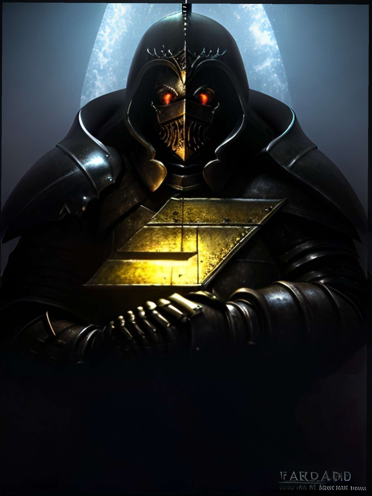

# 👨‍🔧 Support

Le rôle d'un support sur Vespucci RP est de principalement répondre a toutes les demandes sur discord et de dispatcher les tickets vers les personnes qui peuvent s'en occuper, il est en charge d'évaluer la demande d'un joueur et d'en attribuer la tâche a un administrateur ou un modérateur, il gère également toutes les Whitelist du serveur, il ne possède aucune permission en jeu.

## Strike Aka Joker / Simon

🫠 Support sur Vespucci RP

<figure><figcaption>
Photo de profil de Strike / Simon Joker
</figcaption></figure>

Petit texte de présentation a venir
